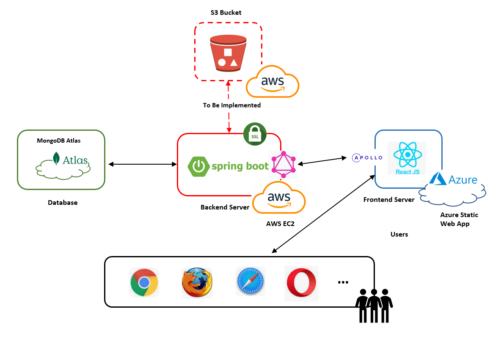
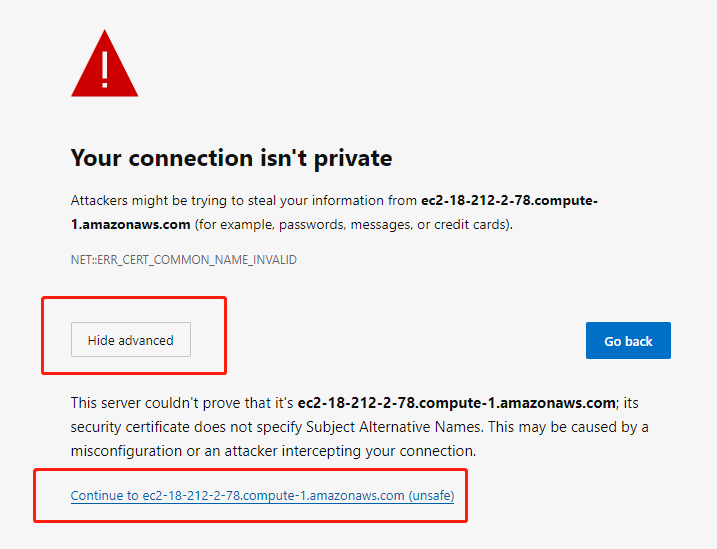

# Photo Sharing Website Frontend
This project is for GNG5300 Individual Project Frontend\
**Highlighted Features:**\
User can upload photo and delete photo\
User can like and unlike photo\
When user likes or unlikes photo, the favorites page will be synchronized.\
When user deletes a photo, the photo will be removed from all users's like list automatically.

# Tech Stack
**Framework:** React.js \
**CI/CD**: Github Actions\
**Cloud Platform:** Azure Static Web App\
**API Caller:** Apollo GraphQL

# System Architecture

# Deployment
 https://delightful-coast-0f8ee860f.2.azurestaticapps.net/login 

 ## IMPORTANT!!!
Before visiting the deployment link, please visit [this link](https://ec2-18-212-2-78.compute-1.amazonaws.com/graphiql) (It is my backend API URL)\
If the following information shows up, please click `advanced -> Continue to ec2-18-212-2-78.compute-1.amazonaws.com (unsafe)`first and then you can visit [the deployed website]( https://delightful-coast-0f8ee860f.2.azurestaticapps.net/login ).

 

**Explanation:** Azure Static Web App accepts https communication only while AWS EC2 deployment is HTTP url. Therefore I self-signed a SSL certificate for the backend project. However, this self-signed certificate will be considered unsafe and thus blocked by modern browser like chrome. In this way, user needs to configure Chrome or other browsers to make the browser permitted to communicate with backend API to fetch data. The easiest way to configure that is by clicking the above backend API url and grant the permission.

# Preview

**Home Page**
 

**Upload Page**

